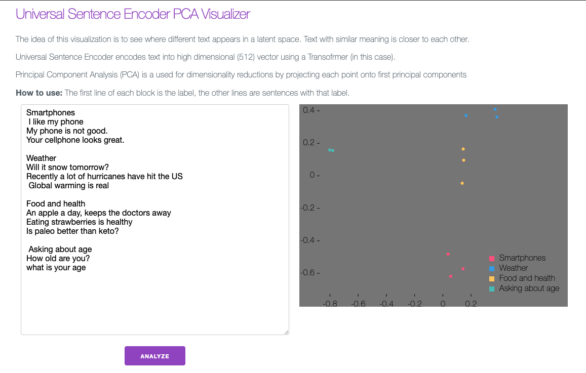

# Universal Sentence Encoder & Principal Component Analysis Visualization

This project uses [tensorflow universal sentence encoder](https://www.tensorflow.org/hub/tutorials/semantic_similarity_with_tf_hub_universal_encoder) to encode the text and then uses [PCA](https://github.com/mljs/pca) to reduce the dimensions and then plot with [D3](https://github.com/d3/d3).




## Get started

Install the dependencies...

```bash
cd use-pca-plot
npm install
```

...then start [Rollup](https://rollupjs.org):

```bash
npm run dev
```

Navigate to [localhost:5000](http://localhost:5000). You should see your app running. Edit a component file in `src`, save it, and reload the page to see your changes. The frontend is [Svelte](https://svelte.dev) with [Milligram](https://milligram.io/).
